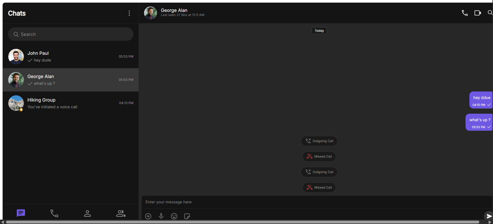
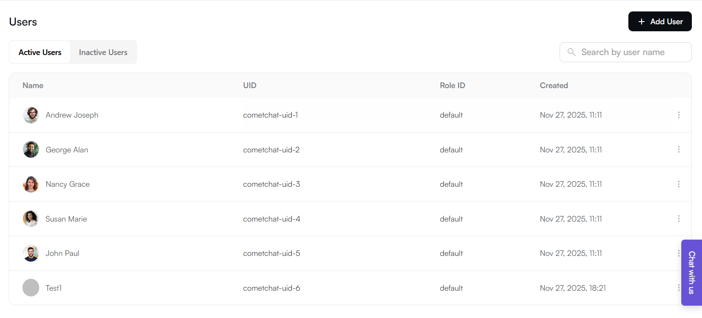
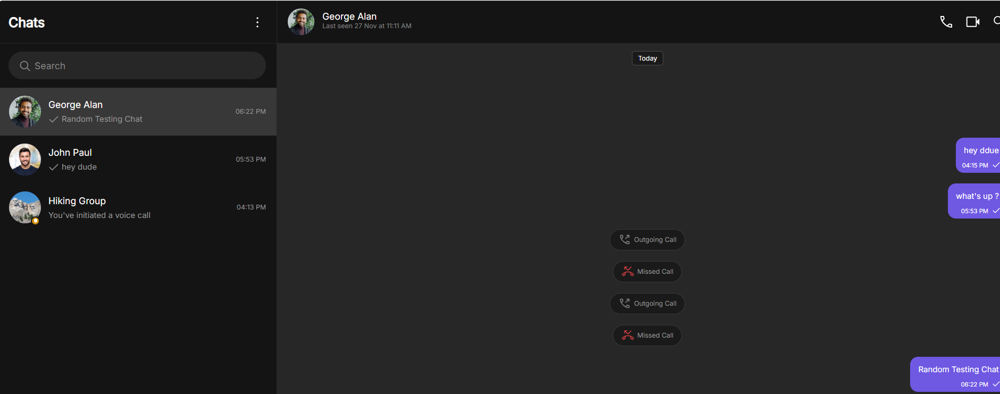

# CometChat UI Kit Implementation – Internship Task

This repository contains my implementation of the CometChat React UI Kit generated using the UI Kit Builder. The goal was to explore the CometChat dashboard, generate a UI Kit, integrate it into a React project, and run it locally.

## 🔧 Tech Stack

- React + Vite
- TypeScript
- CometChat React UI Kit
- CometChat Chat SDK
- Node.js + npm

## Project Setup

### 1. Install dependencies

```bash
npm install
```



## CometChat Configuration

The CometChat setup is done in `main.tsx` using:

- **APP_ID**
- **REGION**
- **AUTH_KEY**

All values are taken from the CometChat dashboard.

---

## User Setup

Users must be created in the CometChat dashboard before they appear inside the UI Kit.

Navigate to:

**Dashboard → Users → Create User**

Create users such as:

- user1
- user2
- test01



---

## 🧪 What Works

- UI Kit renders correctly
- Users list loads after user creation
- Chat UI, components, and layout work as expected
- Vite reload & performance are smooth
- UIKit initialization succeeds after proper configuration



## Project Structure

cometchat-test-app/
│
├── src/
│ ├── CometChat/
│ ├── components/
│ ├── context/
│ ├── utils/
│ └── App.tsx
│
├── index.html
├── package.json
└── vite.config.ts
